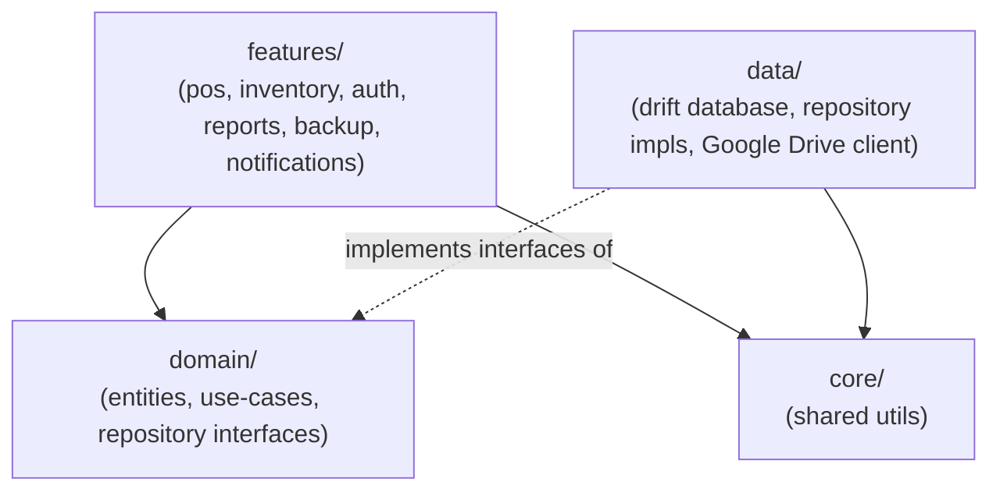

# Pharmacy Inventory Platform

Offline-first inventory and point-of-sale app for small pharmacies. Single Flutter
codebase, installable on Windows (desktop `.exe`) and Android.

See [`docs/superpowers/specs/2026-07-08-pharmacy-inventory-platform-design.md`](docs/superpowers/specs/2026-07-08-pharmacy-inventory-platform-design.md)
for the full product design.

## Stack

- Flutter (stable channel) — one codebase, Windows + Android
- `drift` — local SQLite database
- `flutter_riverpod` — state management
- ARB-based i18n — `id` (default) and `en`

## Installation & Releases

- **Windows (.msix / .zip)** & **Android (.apk)** downloads are available on [GitHub Releases](https://github.com/programmer-newbie-code/pharmacy-inventory-platform/releases/latest).
- See **[`docs/INSTALLATION.md`](docs/INSTALLATION.md)** for detailed installation steps, including how to resolve Windows MSIX publisher certificate verification error `0x800B010A`.

## Getting started

```bash
flutter create --platforms=windows,android --org com.programmernewbiecode .
flutter pub get
dart run build_runner build --delete-conflicting-outputs
flutter test
flutter run -d windows   # or: flutter run -d <android-device-id>
```

`android/` and `windows/` are not committed — the first command above generates them
locally. This keeps the repo free of generated platform boilerplate until a native
customization requires hand-editing it (see `.gitignore`).

## Architecture



See [`AGENT.md`](AGENT.md) for the full coding standards this structure implies.

## Contributing

All changes go through a PR. CI must be green (`flutter analyze`, tests at ≥80% line
coverage, Windows build, Android build) before merge. This is enforced by convention,
not branch protection — the repo is private on GitHub's free plan, which doesn't
support the branch-protection API. See [`AGENT.md`](AGENT.md) for details.

## License

This software is licensed under the **[PolyForm Noncommercial License 1.0.0](LICENSE)**.

- **For Individuals & Pharmacies**: Free to use, install, and run for your operational business needs (managing inventory, POS sales of drugs, etc.).
- **Monetization & Commercial Restriction**: Third parties may **NOT** sell, resell, charge SaaS/subscription fees, package, or monetize this app or code in any way.
- **Exclusive Rights**: Commercial monetization and licensing rights are exclusively reserved for the original creators.

