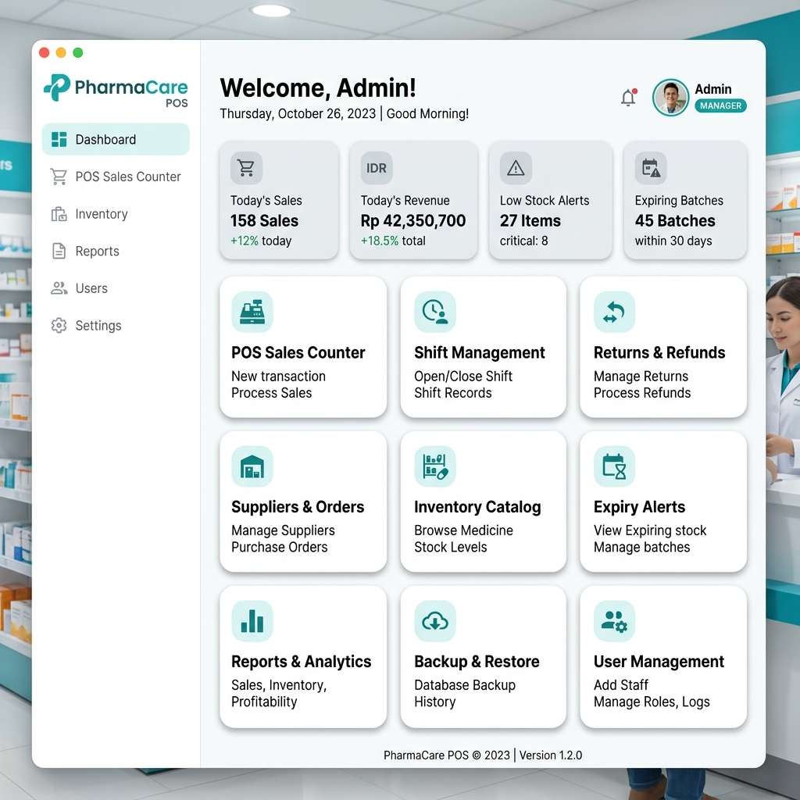
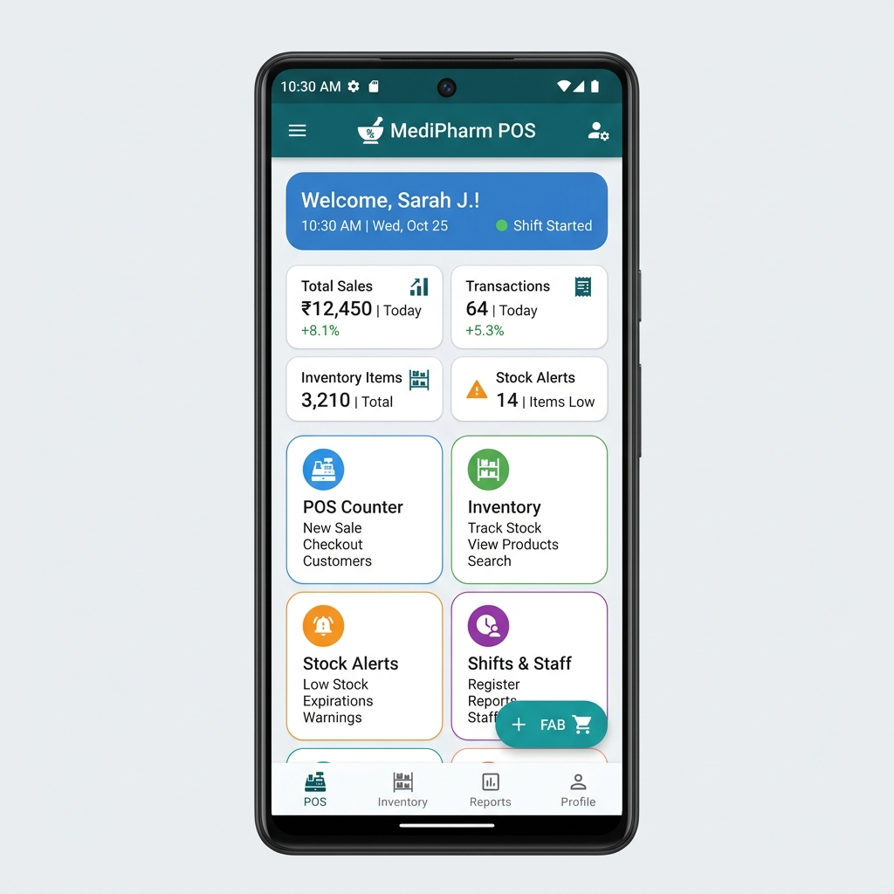
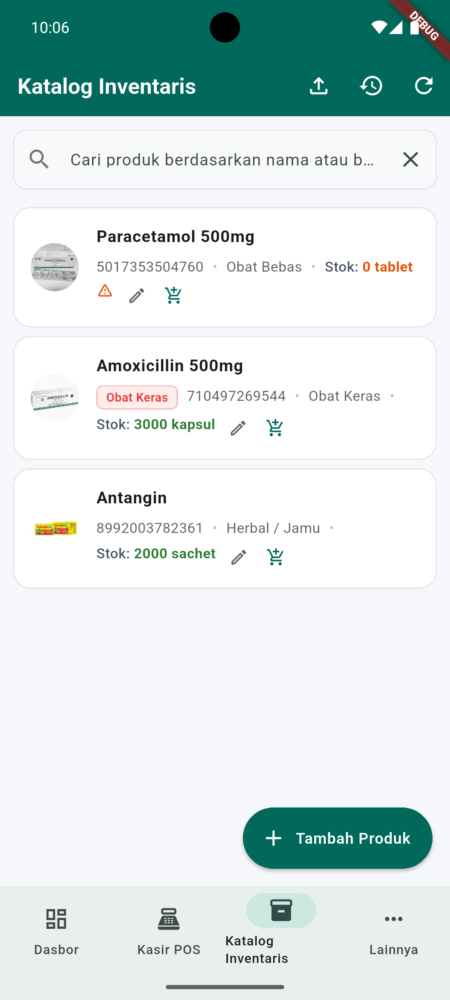
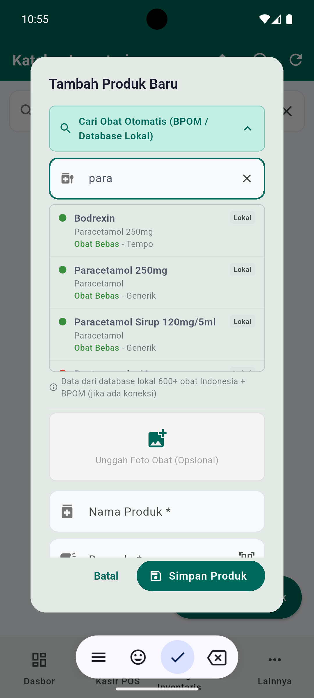
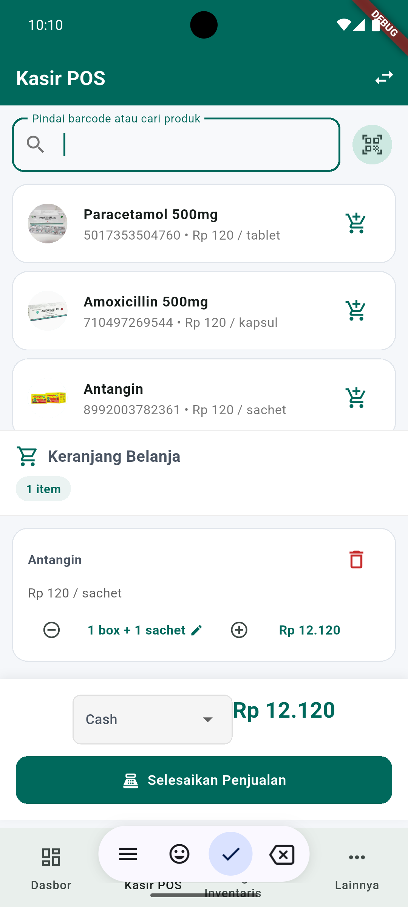
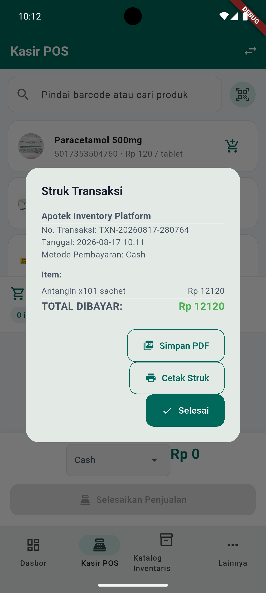
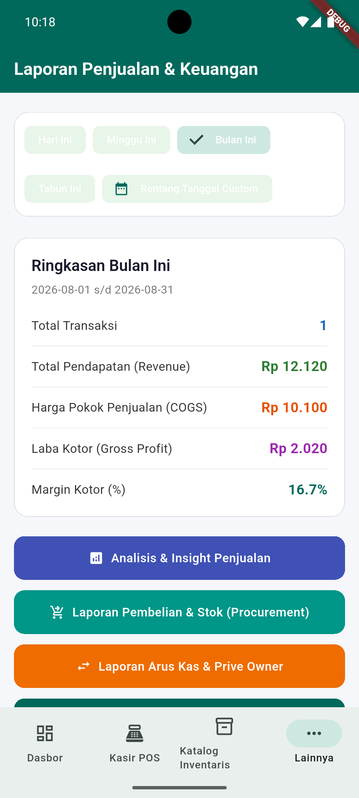
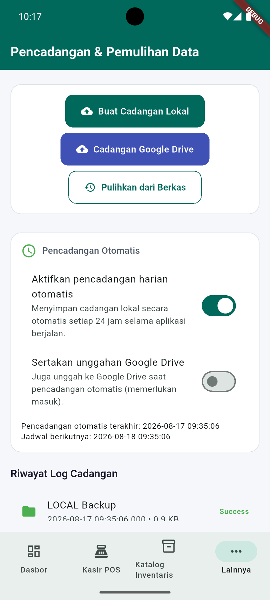

### 📱 Multi-Platform Interface Overview

<div class="platform-gallery">
  <figure class="platform-gallery__item">
    <figcaption>💻 Windows Desktop Dashboard</figcaption>
    <a href="assets/images/desktop_ui.png">
      
    </a>
  </figure>
  <figure class="platform-gallery__item">
    <figcaption>📱 Android Mobile Dashboard</figcaption>
    <a href="assets/images/android_ui.png">
      
    </a>
  </figure>
</div>

### 📸 Android Mobile Workflow & Feature Tour

<div class="mobile-feature-gallery">
  <figure class="platform-gallery__item">
    <figcaption>📦 Inventory Catalog</figcaption>
    <a href="assets/images/android_inventory.png">
      
    </a>
  </figure>
  <figure class="platform-gallery__item">
    <figcaption>🔍 BPOM & Drug Lookup</figcaption>
    <a href="assets/images/android_drug_lookup.png">
      
    </a>
  </figure>
  <figure class="platform-gallery__item">
    <figcaption>🛒 Kasir POS Checkout</figcaption>
    <a href="assets/images/android_pos.png">
      
    </a>
  </figure>
  <figure class="platform-gallery__item">
    <figcaption>🧾 In-App Receipt</figcaption>
    <a href="assets/images/android_receipt.png">
      
    </a>
  </figure>
  <figure class="platform-gallery__item">
    <figcaption>📊 Financial Analytics</figcaption>
    <a href="assets/images/android_report.png">
      
    </a>
  </figure>
  <figure class="platform-gallery__item">
    <figcaption>🔒 Google Drive Backup</figcaption>
    <a href="assets/images/android_backup.png">
      
    </a>
  </figure>
</div>

## 📥 Installation & Setup Guide

### Windows Installation
1. **Standard MSIX Installer**: Download `.msix` from [Latest Releases](https://github.com/programmer-newbie-code/pharmacy-inventory-platform/releases/latest) and double-click to install.
2. **Fixing Certificate Error `0x800B010A`**:
   - If Windows blocks installation saying *"Publisher certificate could not be verified (0x800B010A)"*:
   - Right-click `.msix` -> Properties -> **Digital Signatures** tab -> select signature -> Details -> **View Certificate**.
   - Click **Install Certificate...** -> Store Location: **Local Machine** -> Place all certificates in **Trusted People** -> Finish.
   - Re-open the `.msix` installer to complete installation!
3. **Portable ZIP Package**: Alternatively, download `.zip`, extract to any folder, and run `pharmacy_inventory_platform.exe` directly.

### Android Installation
1. Download `.apk` from [Latest Releases](https://github.com/programmer-newbie-code/pharmacy-inventory-platform/releases/latest).
2. Allow "Install Unknown Apps" if prompted by Android.
3. Tap **Install**.

---

## 📖 User Guide & Operating Manual

### 1. First-Time Administrator Setup
When launching the application for the first time on Windows or Android:
1. Enter your full name, desired username, and a strong password.
2. Click **Create Administrator Account**. The system will set up the SQLite database and log you into the Admin dashboard.

---

### 2. Managing Employee Accounts & Roles
1. Log in using an **Admin** account.
2. Click **User Management** on the main dashboard.
3. Click **Add Employee Account**, enter username, initial password, and select role:
   - **Admin**: Full system access, user management, and database backup/restore.
   - **Pharmacist / Inventory**: Catalog management, stock receipt, storage location assignment.
   - **Cashier (Kasir)**: POS sales counter, cart management, receipt generation.
   - **Auditor**: Read-only audit trail and compliance log access.

---

### 3. POS Sales Counter & FEFO Deduction
1. Navigate to **POS Sales Counter** from the main navigation menu.
2. Search for items by name or scan barcode using a USB or Bluetooth barcode scanner.
3. Adjust item quantities in the cart.
4. **Controlled Drug Verification**:
   - For prescription drugs (`isControlled`), fill out the **Doctor Name**, **Patient Name**, and check **Prescription Verified**.
5. Click **Complete Sale (Checkout)** to finish the transaction:
   - Stock is automatically allocated and deducted from the **earliest expiring stock batch** first (FEFO logic).
   - If a selling price is below the base unit cost price, a safety warning prompt appears before finalizing.

---

### 4. Receiving Stock Batches & Unit Conversion
1. Open **Inventory Catalog** -> Select Target Product.
2. Click **Receive Stock Batch**.
3. Input Batch Number, Supplier, Expiry Date, Received Quantity, Cost Price, and Selling Price.
4. Configure Unit Conversion specs (e.g., `1 Box = 100 Tablets`) so stock is calculated accurately at both wholesale and retail levels.

---

### 5. Expiry Watchlist & Low Stock Alerts
1. Open **Expiry & Low Stock Alerts**.
2. **Expiring Batches Tab**: View stock batches expiring within **30, 60, 90, or 180 days** with color-coded warning badges.
3. **Low Stock Tab**: Displays items whose total remaining stock has reached or dropped below their configured **Reorder Threshold**.

---

### 6. Database Backup & BPOM Compliance Export
1. Open **Database Backup & Audit**.
2. Click **Create Local Backup**: Generates a full JSON dataset snapshot (`pharmacy_backup_<timestamp>.json`).
3. Click **Restore Database**: Select a valid backup file to restore records atomically within SQLite transactions.
4. **BPOM Regulatory CSV Export**: Click **Export Prescription Sales CSV** to generate structured compliance logs for regulatory auditing.

---

### 7. Google Cloud OAuth & Google Drive Setup
1. Enable **Google Drive API** in Google Cloud Console.
2. Configure **OAuth Consent Screen** with scope `https://www.googleapis.com/auth/drive.file`.
3. Set up **Android OAuth Client ID** with package name `com.programmernewbiecode.pharmaloka` and SHA-1 signing certificate fingerprint.
4. Set up a **Desktop OAuth Client** for Windows. Do not commit its credentials.
5. Build the Windows app with the desktop credentials supplied only at build time:

```bash
flutter build windows --release \
  --dart-define=GOOGLE_DRIVE_DESKTOP_CLIENT_ID=your-client-id \
  --dart-define=GOOGLE_DRIVE_DESKTOP_CLIENT_SECRET=your-client-secret
```

---

### 8. Verified Device-to-Device Transfer Checklist
- [ ] Perform final Local Backup & Google Drive Sync on the old device.
- [ ] Verify `BackupLogs` audit trail shows `SUCCESS` and non-zero backup file size.
- [ ] Transfer backup `.json` file to the new device via USB or Google Drive download.
- [ ] Launch app on new device and select **Restore from Backup**.
- [ ] Verify inventory stock, POS sales history, and user permissions match on the new device.

---

## 💻 Technical Architecture & Setup

```bash
# 1. Clone Repository
git clone https://github.com/programmer-newbie-code/pharmacy-inventory-platform.git
cd pharmacy-inventory-platform

# 2. Fetch Flutter Dependencies
flutter pub get

# 3. Generate Database & Drift Code
dart run build_runner build --delete-conflicting-outputs

# 4. Run Test Suite
flutter test --coverage

# 5. Launch Application on Windows
flutter run -d windows
```

